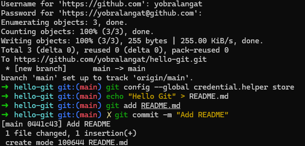

# Hello Git CLI Demo
A simple CLI app built to learn Git basics, commit flow, and GitHub publishing.


## Features
- Prints a friendly terminal greeting
- Uses Node.js or shell scripting
- Git workflow and WSL screenshot for reference

## Built With
- Zsh on WSL
- Git + GitHub
- Markdown



## Usage
Run the script via:
```bash
node index.js

